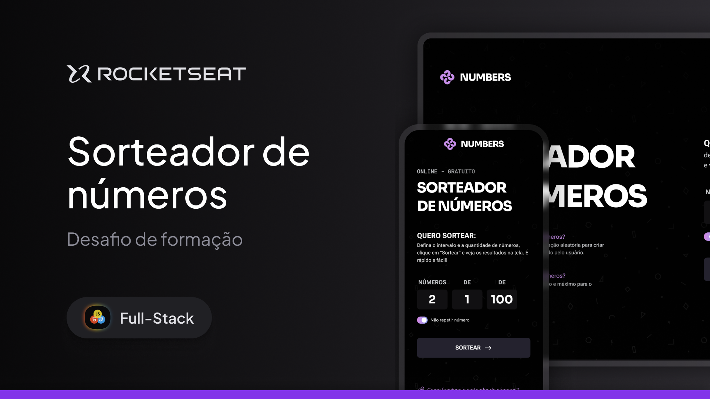

# Desafio Sorteador

  
    

## Sobre:

Desafio desenvolvido durante a formação Full Stack da Rocketseat.

O Sorteador permite o usuário gerar uma quantidade de números aleatórios dentro de um intervalo escolhido.

O desafio foi realizado seguindo os tópicos aprendidos no módulo [Javascript Intermediário](https://github.com/ayresrouxio/rocketseat-javascript-intermediario)

## Tecnologias:

- Figma;
- HTML e CSS;
- Javascript;

## Tópicos:

- HTML e CSS;
- Manipulação do DOM;
- Eventos;
- Funções;
